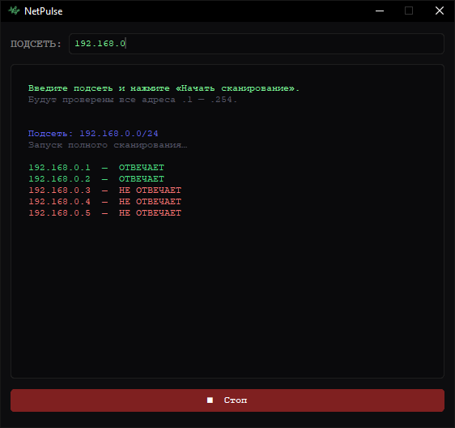

# NetPulse


## 🔍 Простой сканер IP-адресов в локальной сети

**NetPulse** — десктопное приложение для Windows с минималистичным интерфейсом в терминальном стиле, позволяющее быстро обнаружить все активные хосты в заданной подсети методом ICMP ping. Построено на базе [CustomTkinter](https://github.com/TomSchimansky/CustomTkinter).

---

## ✨ Возможности:

- Сканирование всех адресов подсети `.1` — `.254`
- Цветной вывод результатов: 🟢 доступные, 🔴 недоступные хосты
- Остановка сканирования в любой момент кнопкой **■ Стоп**
- Анимированный запуск интерфейса
- Минималистичный тёмный интерфейс в стиле терминала

---

## ⚙️ Установка:

### Вариант 1 — готовый `.exe` (рекомендуется):

1. Скачать последний релиз из раздела [https://github.com/frostbittenbull/NetPulse](https://github.com/frostbittenbull/NetPulse)
2. Запустить `NetPulse.exe`

### Вариант 2 — из исходников:

```bash
git clone <repo-url>
cd subnet-scanner
pip install customtkinter
python main.py
```

---

## 🖥️ Использование:

1. Введите подсеть в поле `ПОДСЕТЬ` — например, `192.168.1`
2. Нажмите **▶ Начать сканирование**
3. Дождитесь результатов или нажмите **■ Стоп** для досрочной остановки

---

## 📦 Сборка в .exe:

Убедитесь, что `icon.ico` лежит рядом с `main.py`, затем выполните:

```bat
pyinstaller --onefile --noconsole --icon="icon.ico" --add-data "icon.ico;." main.py
```

Готовый `.exe` появится в папке `dist\`.

---

## 🖼️ Скриншот:



---

## 🛠️ Стек технологий:

- Python 3.10+
- [CustomTkinter](https://github.com/TomSchimansky/CustomTkinter)
